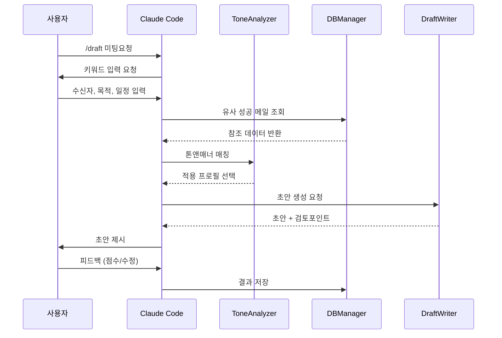
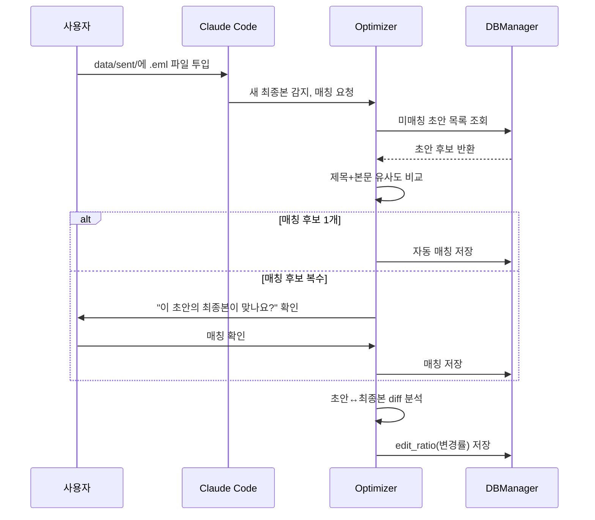
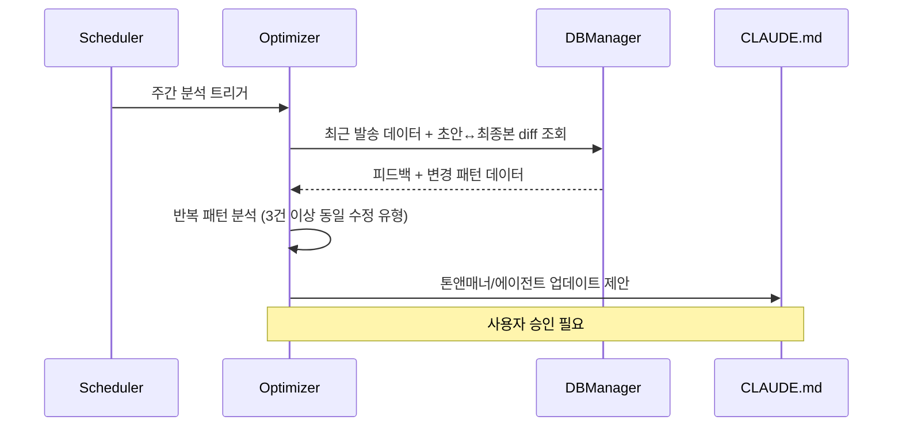

# 📧 Mailing Agent - Claude Code 프로젝트 설계서

> AX(Agent Experience) 기획 문서 | 작성일: 2026-04-14

---

## 1. 프로젝트 개요

### 1.1 목표
Claude Code 환경에서 동작하는 **지능형 메일 초안 작성 에이전트** 구축

### 1.2 핵심 기능 흐름 (마인드맵 기반)

```
┌─────────────────────────────────────────────────────────────────┐
│                      Mailing Agent                               │
└─────────────────────────────────────────────────────────────────┘
         │
         ├── 1️⃣ AI 분석 메일 톤앤매너 정의
         │      ├── claude.md (프로젝트 컨텍스트)
         │      └── agents/skill (에이전트 스킬셋)
         │
         ├── 2️⃣ DB 구축
         │      └── 메일 발송 결과물 저장/관리
         │
         ├── 3️⃣ DB 분석 → 1단계 고도화
         │      └── 발송 데이터 기반 톤앤매너 최적화
         │
         ├── 4️⃣ 필수 키워드 입력
         │      ├── 핵심 참고메일
         │      └── 핵심 상황 키워드
         │
         └── 5️⃣ 메일 초안 완성
               └── 최종 드래프트 생성
```

---

## 2. 프로젝트 구조

```
mailing-agent/
├── CLAUDE.md                    # 프로젝트 전역 컨텍스트
├── .claude/
│   ├── agents/
│   │   ├── tone-analyzer.md     # 톤앤매너 분석 에이전트
│   │   ├── db-manager.md        # DB 관리 에이전트
│   │   ├── optimizer.md         # 고도화 분석 에이전트
│   │   └── draft-writer.md      # 메일 초안 작성 에이전트
│   ├── skills/
│   │   ├── email-parsing.md     # 이메일 파싱 스킬 (.eml 형식 사용 — 텍스트 기반이라 Read 도구로 직접 파싱 가능)
│   │   └── keyword-extract.md   # 키워드 추출 스킬
│   └── commands/
│       ├── analyze.md           # /analyze 명령어
│       ├── draft.md             # /draft 명령어
│       └── optimize.md          # /optimize 명령어
├── data/
│   ├── emails/                  # 참조 이메일 저장소
│   ├── drafts/                  # AI 초안 저장소 (Claude가 자동 저장, 형식: {YYYYMMDD}_{제목요약}.md)
│   ├── sent/                    # 최종 발송본 저장소 (사용자가 Outlook에서 .eml 내보내 수동 투입)
│   └── templates/               # 톤앤매너 템플릿
├── src/
│   ├── analyzer.py              # 톤앤매너 분석 로직
│   ├── database.py              # SQLite DB 관리
│   ├── optimizer.py             # 피드백 기반 최적화
│   └── generator.py             # 메일 생성 엔진
└── config/
    └── tone_profiles.json       # 톤앤매너 프로필 설정
```

---

## 3. 단계별 상세 설계

### 3.1 1단계: AI 분석 메일 톤앤매너 정의

#### CLAUDE.md 설계
```markdown
# Mailing Agent Project

## 프로젝트 컨텍스트
- 목적: 사용자 맞춤형 업무 메일 초안 자동 생성
- 핵심 가치: 일관된 톤앤매너, 상황 적합성, 효율성

## 코딩 컨벤션
- Python 3.11+, Type hints 필수
- DB: SQLite (data/emails.db)
- 한글 메일 기본, 영문 옵션 지원

## 톤앤매너 기본 원칙
- 비즈니스 포멀 (기본)
- 간결하고 명확한 문장
- 요청사항 명시적 표현

## 주의사항
- 민감 정보(개인정보, 기밀) 포함 시 사용자에게 물어보고 포함할것
- 이모지 사용 절대 금지
- 첨부파일 언급 시 확인 필수
```

#### tone-analyzer.md 에이전트 설계
```yaml
---
name: tone-analyzer
description: 참조 이메일의 톤앤매너를 분석하는 전문 에이전트
tools:
  - Read
  - Write
  - Glob
constraints:
  - 분석 결과는 항상 JSON 형식으로 저장
  - 개인정보 마스킹 필수
---

# Tone Analyzer Agent

## 역할
참조 이메일을 분석하여 다음 요소를 추출:
- 문체 (formal/casual/semi-formal)
- 어조 (assertive/polite/neutral)
- 문장 길이 패턴
- 자주 사용되는 표현/관용구
- 인사말/맺음말 패턴

## 출력 형식
분석 결과를 `data/templates/{profile_name}.json`에 저장
```

---

### 3.2 2단계: DB 구축

#### database.py 스키마 설계
```python
# 메일 발송 결과 테이블 구조

CREATE TABLE sent_emails (
    id INTEGER PRIMARY KEY AUTOINCREMENT,
    created_at TIMESTAMP DEFAULT CURRENT_TIMESTAMP,
    subject TEXT NOT NULL,
    recipient_type TEXT,  -- 'internal', 'external', 'client'
    tone_profile TEXT,    -- 사용된 톤앤매너 프로필
    content TEXT NOT NULL,
    keywords TEXT,        -- JSON array
    file_path TEXT,       -- data/sent/ 내 .eml 파일 경로
    feedback_score INTEGER,  -- 1-5 사용자 평가
    feedback_comment TEXT,
    was_edited BOOLEAN,   -- 수정 여부
    edit_ratio FLOAT      -- 수정 비율
);

CREATE TABLE email_drafts (
    id INTEGER PRIMARY KEY AUTOINCREMENT,
    created_at TIMESTAMP DEFAULT CURRENT_TIMESTAMP,
    subject TEXT NOT NULL,
    content TEXT NOT NULL,
    tone_profile TEXT,
    keywords TEXT,              -- JSON array
    file_path TEXT,             -- data/drafts/ 내 .md 파일 경로
    matched_sent_id INTEGER,    -- 매칭된 sent_emails.id (NULL이면 미매칭)
    match_confidence FLOAT,     -- 매칭 신뢰도 (0~1)
    FOREIGN KEY (matched_sent_id) REFERENCES sent_emails(id)
);

CREATE TABLE reference_emails (
    id INTEGER PRIMARY KEY AUTOINCREMENT,
    source TEXT,          -- 'user_provided', 'successful_sent'
    subject TEXT,
    content TEXT,
    tone_analysis TEXT,   -- JSON
    created_at TIMESTAMP DEFAULT CURRENT_TIMESTAMP
);

CREATE TABLE tone_profiles (
    id INTEGER PRIMARY KEY AUTOINCREMENT,
    name TEXT UNIQUE,
    settings TEXT,        -- JSON
    success_rate FLOAT,
    usage_count INTEGER DEFAULT 0
);
```

#### db-manager.md 에이전트 설계
```yaml
---
name: db-manager
description: 이메일 데이터베이스를 관리하고 쿼리하는 에이전트
tools:
  - Read
  - Write
  - Bash
constraints:
  - SELECT 쿼리만 직접 실행
  - INSERT/UPDATE는 반드시 사용자 확인 후 실행
---

# DB Manager Agent

## 핵심 기능
1. 발송 메일 저장
2. 참조 메일 등록
3. 통계 쿼리 실행
4. 데이터 백업/복구
```

---

### 3.3 3단계: DB 분석 → 톤앤매너 고도화

#### optimizer.md 에이전트 설계
```yaml
---
name: optimizer
description: 발송 데이터를 분석하여 톤앤매너를 지속적으로 개선하는 에이전트
tools:
  - Read
  - Write
  - Bash
triggers:
  - 피드백 점수 3점 이하 발생 시
  - 누적 발송 10건마다
---

# Optimizer Agent

## 분석 메트릭
1. **성공률 분석**
   - 피드백 점수 평균
   - 수정 없이 발송된 비율

2. **패턴 학습**
   - 높은 점수 메일의 공통 특성
   - 수정된 부분의 패턴 분석

3. **A/B 테스트 결과**
   - 톤앤매너 프로필별 성과 비교

## 고도화 프로세스
1. 주간 데이터 집계
2. 성공/실패 패턴 분석
3. tone_profiles 업데이트 제안
4. CLAUDE.md 업데이트 (사용자 승인 후)

## 자동 고도화 플로우 (초안 vs 최종본 비교)

### 트리거
- data/sent/에 새 .eml 파일 감지 시
- /optimize 명령어 수동 실행 시

### 초안↔최종본 매칭 방법
사용자가 data/sent/에 .eml 파일을 넣으면 시스템이 자동으로 기존 초안과 매칭:
1. **제목 비교** (최우선): 초안 제목과 .eml 제목의 유사도 측정
2. **본문 유사도**: 초안 본문과 .eml 본문을 비교 (difflib 기반)
3. **시간 순서**: 초안 생성일 이후에 발송된 메일만 후보로 탐색
- 매칭 후보 1개 → 자동 연결
- 매칭 후보 복수 → 사용자에게 "이 초안의 최종본이 맞나요?" 확인

### 분석 프로세스
1. 매칭 완료 후 초안↔최종본 diff 분석:
   - 제목 변경 여부
   - 본문 추가/삭제/수정된 부분 식별
   - 톤앤매너 변화 감지 (formal→semi-formal 등)
2. 변경 패턴 분류: 톤 조정 / 내용 보강 / 구조 변경 / 표현 다듬기
3. 반복 패턴 감지 시 (동일 유형 수정 3건 이상 누적):
   - tone_profiles 업데이트 제안
   - CLAUDE.md 톤앤매너 원칙 수정 제안
   - draft-writer 에이전트 프롬프트 개선 제안
4. 모든 변경은 사용자 승인 후 반영
```

---

### 3.4 4단계: 필수 키워드 입력

#### /draft 슬래시 명령어 설계
```yaml
---
name: draft
description: 메일 초안 작성을 시작하는 명령어
arguments:
  - name: situation
    description: 메일 상황 키워드 (예: 미팅요청, 보고, 문의)
    required: true
  - name: reference
    description: 참고할 메일 파일 경로
    required: false
---

# /draft 명령어

## 입력 프롬프트 흐름

### Step 1: 상황 파악
```
📧 메일 초안 작성을 시작합니다.

1. 메일 유형을 선택하세요:
   [ ] 미팅 요청
   [ ] 업무 보고
   [ ] 자료 요청
   [ ] 협조 요청
   [ ] 감사/인사
   [ ] 기타: ______
```

### Step 2: 핵심 키워드 입력
```
2. 핵심 상황 키워드를 입력하세요:
   - 수신자: (예: 김팀장님, 마케팅팀)
   - 목적: (예: Q2 실적 보고)
   - 주요 내용: (예: 매출 20% 증가, 신규 고객 50건)
   - 기한/일정: (예: 4월 20일까지)
   - 톤: (예: 정중함, 긴급함)
```

### Step 3: 참고 메일 (선택)
```
3. 참고할 메일이 있나요?
   - 파일 경로 또는 내용 붙여넣기
   - 없으면 Enter로 건너뛰기
```
```

---

### 3.5 5단계: 메일 초안 완성

#### draft-writer.md 에이전트 설계
```yaml
---
name: draft-writer
description: 수집된 정보를 바탕으로 메일 초안을 생성하는 핵심 에이전트
tools:
  - Read
  - Write
inherits:
  - tone-analyzer
  - db-manager
---

# Draft Writer Agent

## 생성 프로세스

### 1. 컨텍스트 로딩
- CLAUDE.md 톤앤매너 원칙 로드
- 해당 상황의 성공 메일 샘플 조회 (DB)
- 참고 메일 톤 분석 결과 로드

### 2. 초안 생성
- 제목 3개 옵션 제시
- 본문 초안 작성
- 인사말/맺음말 자동 매칭

### 3. 검토 포인트 표시
- [확인필요] 태그로 불확실한 부분 표시
- 첨부파일 언급 시 리마인드

### 4. 출력 형식
```markdown
## 📧 메일 초안

**제목 옵션:**
1. [추천] {제목1}
2. {제목2}
3. {제목3}

---

**본문:**

{수신자}님께,

{인사말}

{본문 내용}

{맺음말}

{발신자}

---

**✅ 검토 포인트:**
- [ ] 수신자명 확인
- [ ] 일정/기한 확인
- [ ] 첨부파일 확인 (해당 시)

**📊 예상 톤:** {formal/semi-formal} | 예상 길이: {short/medium/long}
```

## 피드백 수집
초안 완성 후 사용자에게 평가 요청:
- 1-5점 점수
- 수정 사항 (있을 경우)
- DB에 자동 저장
```

---

## 4. 실행 워크플로우

### 4.1 일반 사용 시나리오



### 4.2 초안↔최종본 매칭 시나리오



### 4.3 고도화 시나리오



---

## 5. 설치 및 초기 설정

### 5.1 프로젝트 초기화
```bash
# 1. 프로젝트 디렉토리 생성
mkdir mailing-agent && cd mailing-agent

# 2. Claude Code 시작
claude

# 3. 초기 구조 생성
/init  # 기본 구조 생성 후 커스터마이징

# 4. DB 초기화
python src/database.py --init

# 5. 참조 메일 등록 (선택)
/analyze data/emails/sample1.eml
```

### 5.2 첫 사용
```bash
# Claude Code 내에서
/draft

# 또는 직접 요청
"마케팅팀에 Q2 실적 보고 메일 초안 작성해줘. 
핵심: 매출 15% 성장, 신규 캠페인 3건 런칭"
```

---

## 6. 확장 가능성

### 6.1 Phase 2 기능
- [ ] Outlook 연동 (발송 자동화)
- [ ] 수신자별 톤앤매너 자동 조정
- [ ] 메일 스레드 컨텍스트 인식

### 6.2 Phase 3 기능
- [ ] 팀 공유 톤앤매너 프로필
- [ ] 메일 성과 대시보드
- [ ] 자동 A/B 테스트

---

## 7. 핵심 성공 지표 (KPI)

| 지표 | 목표 | 측정 방법 |
|------|------|----------|
| 초안 채택률 | 80%+ | 수정 없이 발송된 비율 (변경률 10% 이하) |
| 평균 피드백 점수 | 4.0+ | 사용자 평가 평균 |
| 작성 시간 단축 | 70%+ | 기존 대비 소요 시간 |
| 톤 일관성 | 90%+ | 프로필 매칭 정확도 |

### 7.1 초안 채택률 측정 구조

| 구분 | 저장 위치 | 저장 주체 | 파일 형식 | 이름 규칙 |
|------|----------|----------|----------|----------|
| AI 초안 | data/drafts/ | Claude (자동) | .md | {YYYYMMDD}_{제목요약}.md |
| 최종 발송본 | data/sent/ | 사용자 (수동) | .eml | Outlook에서 내보낸 그대로 |

**매칭 방법:** 사용자가 data/sent/에 .eml을 넣으면, 시스템이 제목과 본문 유사도를 기준으로 기존 초안과 자동 매칭합니다. 매칭이 불확실하면 사용자에게 확인합니다.

**채택률 계산:** 매칭된 초안-최종본 쌍에서 본문 변경률(edit_ratio)을 측정합니다. 변경률 10% 이하면 "수정 없이 발송"으로 간주합니다.

---

## 8. 참고 자료

- [Claude Code CLAUDE.md 공식 가이드](https://docs.anthropic.com)
- [Custom Agents 설정법](https://claudefa.st/blog/guide/agents/custom-agents)
- [효과적인 CLAUDE.md 작성법](https://www.humanlayer.dev/blog/writing-a-good-claude-md)

---

*본 문서는 AX(Agent Experience) 관점에서 설계되었으며, 실제 구현 시 사용자 피드백을 반영하여 지속적으로 업데이트됩니다.*
